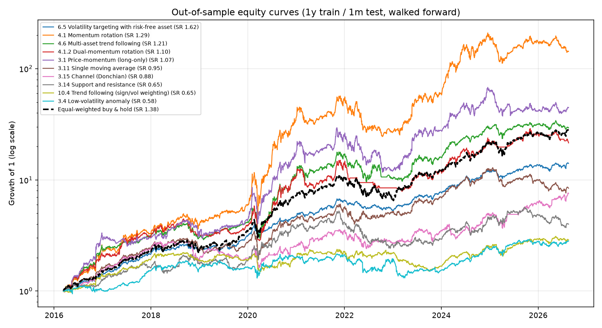
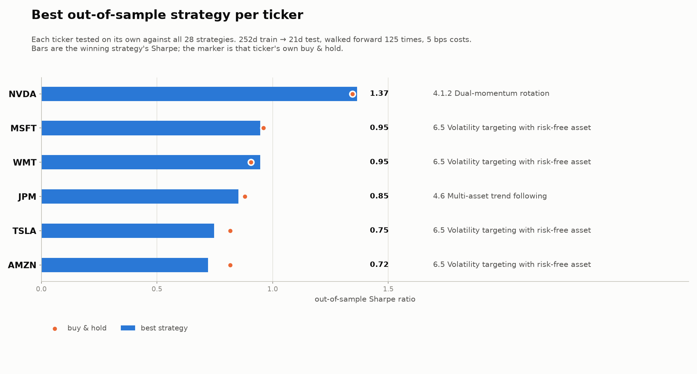

# 151-strategies

A research track for **Kakushadze & Serur, *151 Trading Strategies*** (SSRN
[3247865](https://ssrn.com/abstract=3247865)): it builds the paper's strategies
from their published formulas and backtests them out-of-sample with a sliding
window — **1 year of training data, the following 1 month held out**, walked
forward across the whole history.

Bars come from the QuestDB table **`stooq.daily`**. The study universe is
`NVDA, TSLA, MSFT, AMZN, WMT, JPM`.

---

## Quick start

```bash
./scripts/bootstrap.sh      # QuestDB via docker compose + venv + load stooq.daily
./scripts/run_study.sh      # full walk-forward study -> results/
```

Or step by step:

```bash
docker compose up -d questdb
python3 -m venv .venv && ./.venv/bin/pip install -e ".[dev]"

./.venv/bin/s151 load                       # download bars into stooq.daily
./.venv/bin/s151 status                     # per-ticker coverage
./.venv/bin/s151 catalog --summary          # what the paper contains, by chapter
./.venv/bin/s151 strategies                 # what is runnable here
./.venv/bin/s151 backtest                   # the study
./.venv/bin/s151 backtest --strategies 3.1.price_momentum 3.9.mean_reversion_single_cluster
./.venv/bin/s151 per-ticker                 # best strategy for each name -> data/
./.venv/bin/s151 significance data/<stamp>  # is that winner real, or luck?
```

Everything is configured in [`configs/default.yaml`](configs/default.yaml);
QuestDB connection settings can also be overridden with `QUESTDB_HOST`,
`QUESTDB_PG_PORT`, `QUESTDB_TABLE`, etc.

---

## Method

### The sliding window

```
        |<------ 252 training days ------>|<- 21 test days ->|
fold 0  |=================================|##################|
fold 1        |=================================|##################|
fold 2              |=================================|##################|
                                                    ...
```

For every fold:

1. **Tune in-sample.** The strategy's parameter grid is swept over the 252-day
   training window and scored by the configured objective (Sharpe by default).
2. **Freeze.** The winning parameter set — plus anything estimated on the
   training window (covariance matrices, return clusters, the traded pair, the
   KNN neighbour pool) — is locked.
3. **Trade blind.** Those frozen settings generate weights for the next 21 days.
   Nothing from the test window feeds back into them.

Test windows are consecutive and disjoint, so concatenating them gives one
continuous out-of-sample track record with **no overlap and no refitting inside
it**. 125 folds over this universe, covering March 2016 to August 2026.

### Accounting

* **Delay 1.** A signal computed from the close of day *t* is traded into day
  *t+1*, so nothing executes at a price that produced it.
* **Gross exposure 1.** Every strategy is normalised to `sum |w_i| = 1`, so
  long/short and long-only strategies are comparable per dollar deployed.
* **Costs.** 5 bps charged on traded notional, `sum |w_t - w_{t-1}|`. Holding a
  constant target book is free — the standard weights-based convention, applied
  identically to the benchmark.
* **Warmup alignment.** Strategies need different amounts of history (residual
  momentum needs three years of betas; internal bar strength needs a day). By
  default every strategy shares one fold schedule set by the slowest warmup, so
  the leaderboard compares them over an identical out-of-sample period. Pass
  `--no-align-folds` to let each strategy use every fold its own warmup allows.

### Metrics

Four headline statistics, reported for every strategy and for the benchmark:

| Metric | Definition |
|---|---|
| **Annualised return** | Compound growth rate of the out-of-sample equity curve, `prod(1 + r)^(252/n) - 1`, net of costs |
| **Sharpe ratio** | `mean(r) / sd(r) * sqrt(252)` — the statistic used in Appendix A of the paper |
| **Max drawdown** | Worst peak-to-trough loss on the equity curve |
| **Calmar ratio** | Annualised return divided by the absolute max drawdown |

Annualised volatility, hit rate, turnover, Sortino, the gross-vs-net cost
decomposition and average exposures sit alongside them in
`results/leaderboard.csv`. That file keeps every statistic as a **raw fraction**
so downstream analysis does not have to undo formatting; percentage scaling and
unit-bearing column names (`ann_return_%`, `max_drawdown_%`) are applied only in
the rendered `summary.md` and terminal output.

### Guards against look-ahead

`tests/test_strategies.py::test_weights_are_causal` re-runs every strategy on a
panel whose *future* rows have been randomly scrambled and asserts that no
earlier weight moves. `tests/test_engine.py` checks that training windows
strictly precede their test windows and that test windows never overlap.

---

## Results

Full artifacts are in [`results/`](results/):

| File | Contents |
|---|---|
| `summary.md` | rendered leaderboard plus the per-ticker sections |
| `leaderboard.csv` | every statistic per strategy, as raw fractions |
| `ticker_performance.csv` | each ticker's own buy-and-hold record |
| `ticker_attribution.csv` | per-strategy, per-ticker P&L attribution |
| `ticker_universe_attribution.csv` | each ticker rolled up across the library |
| `daily_returns.csv`, `equity_curves.csv/.png` | the out-of-sample track records |
| `folds/<key>.csv` | parameters chosen on each of the 125 training windows |



Out-of-sample, 2016-03-11 to 2026-08-18, 125 folds, net of 5 bps costs. **Annualised return** is compound (CAGR), **max drawdown** is the worst peak-to-trough loss, **Calmar** is the ratio of the two, and **Sharpe** is `mean/sd * sqrt(252)` — the statistic used in Appendix A of the paper. Sorted by Sharpe:

| Section | Strategy | Ann. return | Sharpe | Max drawdown | Calmar | Ann. vol | Turnover |
|---|---|---:|---:|---:|---:|---:|---:|
| 6.5 | Volatility targeting with risk-free asset | 28.9% | **1.62** | -21.4% | 1.35 | 16.5% | 3.1x |
| *–* | *Equal-weighted buy & hold (benchmark)* | *37.6%* | *1.38* | *-40.0%* | *0.94* | *25.4%* | *0.1x* |
| 4.1 | Momentum rotation | 61.1% | **1.29** | -58.1% | 1.05 | 44.6% | 26.3x |
| 4.6 | Multi-asset trend following | 38.3% | **1.21** | -47.0% | 0.81 | 30.8% | 23.3x |
| 4.1.2 | Dual-momentum rotation | 34.3% | **1.10** | -51.3% | 0.67 | 31.1% | 25.4x |
| 3.1 | Price-momentum (long-only) | 44.1% | **1.07** | -60.3% | 0.73 | 42.1% | 41.5x |
| 3.11 | Single moving average | 22.7% | 0.95 | -44.4% | 0.51 | 24.6% | 40.9x |
| 3.15 | Channel (Donchian) | 21.4% | 0.88 | -42.7% | 0.50 | 25.9% | 21.4x |
| 3.14 | Support and resistance | 14.2% | 0.65 | -53.9% | 0.26 | 25.5% | 211.2x |
| 10.4 | Trend following (sign/vol weighting) | 10.7% | 0.65 | -36.4% | 0.29 | 18.3% | 35.7x |
| 3.4 | Low-volatility anomaly | 10.5% | 0.58 | -39.2% | 0.27 | 21.2% | 8.7x |
| 3.12 | Two moving averages | 4.8% | 0.33 | -37.3% | 0.13 | 21.2% | 13.6x |
| 3.13 | Three moving averages | 4.5% | 0.30 | -49.6% | 0.09 | 25.8% | 69.4x |
| 3.1 | Price-momentum (long/short) | 3.6% | 0.27 | -58.5% | 0.06 | 23.6% | 44.5x |
| 3.17 | Single-stock KNN | 3.3% | 0.27 | -56.5% | 0.06 | 19.6% | 183.0x |
| 4.3 | R-squared selectivity | 2.5% | 0.23 | -34.4% | 0.07 | 17.2% | 27.9x |
| 4.1.1 | Momentum rotation with MA filter | 1.2% | 0.19 | -63.4% | 0.02 | 29.6% | 67.4x |
| 3.7 | Residual momentum (market-residual proxy) | -1.9% | -0.03 | -54.3% | -0.04 | 17.0% | 27.7x |
| 3.8 | Pairs trading | -2.9% | -0.13 | -39.6% | -0.07 | 14.5% | 62.6x |
| 4.4 | Mean-reversion (internal bar strength) | -4.8% | -0.15 | -59.7% | -0.08 | 19.4% | 260.8x |
| 10.3 | Contrarian trading (market-index demeaned) | -5.2% | -0.20 | -61.1% | -0.08 | 18.2% | 110.9x |
| 3.20 | Alpha combos | -8.3% | -0.25 | -77.1% | -0.11 | 23.6% | 149.3x |
| 3.9.1 | Mean-reversion (multiple clusters) | -6.9% | -0.28 | -61.6% | -0.11 | 18.9% | 180.4x |
| 3.6 | Multifactor portfolio (rank blend) | -7.5% | -0.36 | -59.7% | -0.13 | 17.6% | 93.5x |
| 3.18.1 | Statistical arbitrage (dollar-neutral) | -6.8% | -0.38 | -65.7% | -0.10 | 15.3% | 129.7x |
| 3.9 | Mean-reversion (single cluster) | -8.9% | -0.42 | -69.9% | -0.13 | 18.4% | 164.2x |
| 3.10 | Mean-reversion (weighted regression) | -8.5% | -0.46 | -67.8% | -0.12 | 16.4% | 174.7x |
| 10.3.1 | Contrarian trading with volume filter | -16.4% | -0.52 | -88.3% | -0.19 | 27.5% | 179.6x |
| 3.18 | Statistical arbitrage (mean-variance optimisation) | -9.1% | -0.60 | -71.8% | -0.13 | 14.1% | 122.6x |

### Reading these numbers

The split is clean and one-directional: **every trend/momentum family is
positive and every cross-sectional mean-reversion family is negative.** That is
an artifact of the universe as much as of the strategies, and it should not be
read as a verdict on the paper.

* **Six names is not a cross-section.** Mean-reversion, statistical arbitrage
  and the multifactor blend are breadth strategies — the paper's own framing is
  deciles of a few thousand stocks, where idiosyncratic noise diversifies away.
  With six names, a "decile" is one or two stocks and the residual return is
  dominated by whichever mega-cap happened to run. Section 3.21 of the paper
  makes exactly this point about where the statistical edge comes from.
* **This universe trended, hard.** 2016-2026 for these six names is close to a
  best case for momentum and a worst case for shorting winners. Symmetrically,
  a systematically negative mean-reversion Sharpe here is the mirror image of a
  positive momentum Sharpe, not independent evidence.
* **Only 6.5 beats the benchmark on Sharpe**, and it does so by cutting
  volatility rather than adding return — which is what volatility targeting is
  for. Nothing here beats buy-and-hold on annualised return at comparable risk.
* **Turnover is not modelled beyond a linear 5 bps.** The high-turnover
  strategies (3.14 at 211x, 4.4 at 261x) would face market impact and borrow
  costs that this accounting ignores; treat their numbers as upper bounds.


### Per-ticker results

The six names are traded as **one universe**, not as six separate backtests —
the cross-sectional strategies rank them against each other, so a per-ticker run
would not even be defined for those. Results are therefore reported two ways.

**1. How each ticker behaved on its own** (`results/ticker_performance.csv`) —
buy and hold over the same out-of-sample window, no strategy involved:

| Ticker | Ann. return | Sharpe | Max drawdown | Calmar | Ann. vol |
|---|---:|---:|---:|---:|---:|
| NVDA | 72.0% | 1.34 | -66.3% | 1.09 | 49.4% |
| MSFT | 25.4% | 0.96 | -37.1% | 0.68 | 27.5% |
| WMT | 19.0% | 0.91 | -25.7% | 0.74 | 21.8% |
| JPM | 22.4% | 0.88 | -43.6% | 0.51 | 27.1% |
| AMZN | 23.9% | 0.82 | -56.1% | 0.42 | 32.7% |
| TSLA | 36.0% | 0.82 | -73.6% | 0.49 | 58.7% |

**2. What each ticker contributed to each strategy**
(`results/ticker_attribution.csv`, 174 rows = 29 strategies x 6 tickers). The
engine decomposes P&L per name before aggregating, so a strategy's per-ticker
contributions sum exactly to its annualised return — the reconciliation is
checked to machine precision in `tests/test_attribution.py`.

Rolled up across the whole library (`ticker_universe_attribution.csv`):

| Ticker | Mean contribution | Best | Worst | Strategies profitable on it | Avg gross weight | Avg net weight |
|---|---:|---:|---:|---:|---:|---:|
| NVDA | +6.91% | +33.53% | -3.40% | 68% | 0.19 | +0.09 |
| TSLA | +1.86% | +18.69% | -8.64% | 54% | 0.16 | +0.04 |
| MSFT | +0.26% | +4.07% | -3.70% | 50% | 0.16 | +0.06 |
| JPM | +0.20% | +3.56% | -4.14% | 57% | 0.15 | +0.05 |
| AMZN | +0.10% | +5.43% | -7.55% | 54% | 0.15 | +0.04 |
| WMT | -0.35% | +6.66% | -3.92% | 36% | 0.17 | +0.07 |

For a single strategy, e.g. 4.1 momentum rotation:

| Ticker | Contribution (ann.) | Share of P&L | Avg gross weight | Days held |
|---|---:|---:|---:|---:|
| NVDA | +33.53% | 58.3% | 0.42 | 61% |
| TSLA | +18.69% | 32.5% | 0.22 | 36% |
| MSFT | +3.40% | 5.9% | 0.12 | 19% |
| JPM | +1.77% | 3.1% | 0.06 | 11% |
| AMZN | +0.97% | 1.7% | 0.08 | 15% |
| WMT | -0.82% | -1.4% | 0.10 | 16% |

NVDA alone produced 58% of that strategy's P&L, and the library as a whole made
money on NVDA and lost money on WMT — a concentration worth keeping in mind
before reading any leaderboard row as a property of the strategy rather than of
the universe.

Add `--per-ticker-daily` to also write each strategy's daily per-ticker
contributions to `results/by_ticker/` (~300 KB per strategy, off by default).


## Best strategy per ticker

`s151 per-ticker` re-runs the whole library against **each name on its own** and
writes a timestamped folder under `data/`:

```bash
s151 per-ticker                       # -> data/YYYYMMDDHHMM/
s151 per-ticker --tickers NVDA JPM    # a subset
```

```
data/202608231618/
  summary.png            best strategy per ticker, one bar each
  summary.md             the same as text, with per-ticker sections
  index.html             browsable page embedding every chart
  best_per_ticker.csv    winner, parameters and margin over buy & hold
  all_results.csv        every (ticker, strategy) pair with its statistics
  significance.png       is the edge real, or the best of many tries?
  significance.csv       Newey-West, Reality Check, SPA and Deflated Sharpe
  NVDA.png               research card - price, position, equity, ranking, parameters
  NVDA_strategies.csv    every strategy ranked for that ticker
  NVDA_daily_returns.csv per-strategy daily P&L, so the tests can be re-run
  ...
```



### Not every strategy can be tested on one name

Roughly half the library is **cross-sectional** - it ranks names against each
other or demeans returns across them. On a universe of one those constructions
cancel exactly: a stock's return demeaned against itself is zero, and a "top
third" that is also the "bottom third" nets out. Others degenerate the other
way - a long-only ranking of one name is just buy & hold.

Both are detected and excluded from the ranking with the reason recorded in
`<TICKER>_strategies.csv`, so **11 of 28** strategies are genuinely applicable
per ticker. Screening happens before the walk-forward, which is also what makes
the study affordable: it sweeps each grid once over the full history instead of
125 times per fold.

### Results

| Ticker | Best strategy | Ann. return | Sharpe | Max drawdown | Calmar | Buy & hold Sharpe | Edge |
|---|---|---:|---:|---:|---:|---:|---:|
| **NVDA** | 4.1.2 Dual-momentum rotation | 60.8% | 1.37 | -41.8% | 1.46 | 1.34 | +0.02 |
| **TSLA** | 6.5 Volatility targeting with risk-free asset | 11.5% | 0.75 | -25.9% | 0.44 | 0.82 | -0.07 |
| **MSFT** | 6.5 Volatility targeting with risk-free asset | 15.7% | 0.95 | -25.0% | 0.63 | 0.96 | -0.01 |
| **AMZN** | 6.5 Volatility targeting with risk-free asset | 12.5% | 0.72 | -35.3% | 0.35 | 0.82 | -0.10 |
| **WMT** | 6.5 Volatility targeting with risk-free asset | 17.1% | 0.95 | -23.3% | 0.74 | 0.91 | +0.04 |
| **JPM** | 4.6 Multi-asset trend following | 16.1% | 0.85 | -33.9% | 0.48 | 0.88 | -0.03 |

Parameters chosen in-sample (most frequent across the 125 training windows):

| Ticker | Section | Parameters |
|---|---|---|
| **NVDA** | 4.1.2 | `formation = 252`, `fraction = 0.34`, `ma_length = 200 (86% of folds)` |
| **TSLA** | 6.5 | `target_vol = 0.15`, `vol_window = 63 (61% of folds)`, `max_leverage = 1.0`, `rebalance_threshold = 0.1 (78% of folds)` |
| **MSFT** | 6.5 | `target_vol = 0.15 (62% of folds)`, `vol_window = 21 (52% of folds)`, `max_leverage = 1.0 (64% of folds)`, `rebalance_threshold = 0.1 (58% of folds)` |
| **AMZN** | 6.5 | `target_vol = 0.15 (62% of folds)`, `vol_window = 21 (78% of folds)`, `max_leverage = 1.0 (78% of folds)`, `rebalance_threshold = 0.0 (58% of folds)` |
| **WMT** | 6.5 | `target_vol = 0.15 (46% of folds)`, `vol_window = 21 (67% of folds)`, `max_leverage = 1.0 (54% of folds)`, `rebalance_threshold = 0.1 (74% of folds)` |
| **JPM** | 4.6 | `formation = 252 (50% of folds)`, `weighting = inverse_vol`, `ma_filter = True (54% of folds)`, `ma_length = 200 (75% of folds)` |

Each ticker's card shows the price series with the winning strategy's long and
short periods shaded, its equity curve against buy & hold, the full ranking, and
the parameters:


### Read the "Edge" column before anything else

The winner beats that ticker's own buy & hold by **+0.02 to +0.04 Sharpe on two
names, and loses on the other four**. That is nothing.

It is also flattered: picking the best of 11 strategies *by out-of-sample
Sharpe* is a selection made on the test set, so the winner's margin is
optimistically biased by construction - the maximum of 11 noisy estimates sits
above their common mean even when no strategy has an edge. The honest reading is
that on a single mega-cap over this period, **none of the paper's single-name
strategies reliably beat holding the stock**. What 6.5 and 4.1.2 do deliver is
materially smaller drawdowns (NVDA -41.8% against -66.3%, AMZN -35.3% against
-56.2%) at a comparable Sharpe - risk reduction, not alpha.


## Is it statistically relevant, or luck?

The winner on each ticker was picked as the **maximum Sharpe out of 11
candidates**. That selection is itself a hypothesis test run 11 times, so the
winner's margin is biased upward even if no strategy has an edge — which makes
a plain t-test on the winner meaningless. `s151 significance` answers three
separate questions:

| Question | Test |
|---|---|
| Is the return series distinguishable from zero? | One-sided **Newey-West** t-test on the mean daily return — autocorrelation-robust, since daily P&L is not i.i.d. |
| Does it beat holding the stock? | The same test on the **difference** series. Beating zero is easy in a bull market. |
| Does it survive being chosen as the best of N? | **White's Reality Check** and **Hansen's SPA**, bootstrapping all 11 candidates jointly with the **stationary bootstrap** of Politis & Romano so serial dependence survives resampling; plus the **Deflated Sharpe Ratio** of Bailey & López de Prado. |


| Ticker | Excess ann. return | t-stat | p vs buy & hold | Reality Check p | SPA p | Deflated Sharpe | Verdict |
|---|---:|---:|---:|---:|---:|---:|---|
| **MSFT** | -10.3% | -2.88 | 1.00 | 1.00 | **0.61** | 0.70 | lower return than buy & hold (significant) |
| **WMT** | -2.3% | -1.05 | 0.85 | 0.99 | **0.69** | 0.88 | profitable, but no better than buy & hold |
| **NVDA** | -10.6% | -1.35 | 0.91 | 0.99 | **0.70** | 0.97 | profitable, but no better than buy & hold |
| **JPM** | -7.0% | -1.53 | 0.94 | 1.00 | **0.75** | 0.66 | profitable, but no better than buy & hold |
| **AMZN** | -13.2% | -2.61 | 1.00 | 1.00 | **0.80** | 0.68 | lower return than buy & hold (significant) |
| **TSLA** | -35.7% | -2.63 | 1.00 | 0.99 | **0.87** | 0.82 | lower return than buy & hold (significant) |

### The answer is no, on every ticker

**Not one strategy survives the selection correction.** SPA p-values run 0.61 to
0.87 — the observed maximum is exactly what 11 candidates produce by chance when
none of them has an edge. Reality Check p-values are 0.98–1.00, and the Deflated
Sharpe probabilities (0.66–0.97) sit below the ~0.95 you would want before
believing a Sharpe that was chosen rather than pre-registered.

Two details worth reading carefully:

* **`p_vs_buy_hold` near 1 is not a tie.** It is a one-sided test for
  outperformance, so a value of 0.996 means the difference runs decisively the
  other way. On AMZN, MSFT and TSLA the winner's return is *significantly lower*
  than buy & hold (t = -2.6 to -2.9).
* **Sharpe and return disagree, and that is the real result.** The Sharpe "edge"
  was ~0 while excess return is -2% to -36% a year, because these strategies cut
  volatility roughly in proportion to return. That is a risk-reduction trade,
  not alpha — and the significance tests confirm there is no alpha to find here.

The tests are validated against synthetic data in `tests/test_significance.py`:
under a simulated null the Reality Check rejects ~6% of the time at α=0.05, under
a planted edge it rejects ~92%, and SPA overtakes it (98% vs 80%) exactly where
theory says it should — when most candidates are hopeless.

```bash
s151 significance data/202608231618                      # re-run from saved series
s151 significance data/202608231618 --draws 20000 --block 20
```

Per-strategy daily return series are saved as `<TICKER>_daily_returns.csv`, so
the tests can be re-run with more draws or a different block length without
touching the backtest.

---

## What is implemented, and what is not

The paper's table of contents carries **175 numbered strategy entries** once
sub-strategies are counted individually. All 175 are catalogued in
[`src/strategies151/catalog.py`](src/strategies151/catalog.py), each tagged with
its status and — when it cannot run here — exactly what data it would need:

```
$ s151 catalog --summary
                     chapter  implemented  not_implemented  substituted  total
                     Options            0               58            0     58
                      Stocks           13                5            4     22
                Fixed Income            0               15            0     15
Exchange-traded funds (ETFs)            2                2            4      8
                 Real Estate            0                8            0      8
                        ...          ...              ...          ...    ...
```

**27 sections are runnable (28 strategy implementations)**, drawn from
Chapter 3 (Stocks), Chapter 4 (ETFs), 6.5 and Chapter 10. The remaining 148
need inputs that daily equity bars cannot supply: option chains (all 58 of
Chapter 2), bond and swap curves, futures term structure, FX rates, tranche
quotes, fundamentals, intraday order books.

`substituted` marks a strategy that *is* implemented from the paper's formulas
but with one documented proxy for an input this universe lacks — for example
residual momentum (3.7) uses the equal-weighted universe return as `MKT` because
there is no Fama-French factor file, and contrarian trading (10.3.1) filters on
volume only because cash equities have no open-interest series. `s151 catalog
--verbose` prints every substitution.

Two adaptations are worth calling out because they change more than an input:

* **3.20 Alpha combos.** Step 9 of the published recipe regresses an `N`-vector
  of expected alpha returns on an `N x (M-1)` matrix, which is well-posed only
  when the number of alphas `N` exceeds the number of observations `M` — the
  paper's setting has `N` in the hundreds of thousands. With a dozen alphas and
  a year of daily returns the system is underdetermined and every residual
  collapses to zero. The implementation caps how many columns of `Lambda` are
  retained; the eleven steps are otherwise verbatim.
* **"Deciles".** Top/bottom deciles of six names select zero stocks, so the
  selection slice is a tunable fraction (default ~1/3, i.e. two names a side).

---

## Data

`stooq.daily` schema, created by `s151 load`:

```sql
CREATE TABLE 'stooq.daily' (
  ticker SYMBOL CAPACITY 4096 CACHE,
  date   TIMESTAMP,
  open   DOUBLE, high DOUBLE, low DOUBLE, close DOUBLE, volume DOUBLE
) TIMESTAMP(date) PARTITION BY YEAR WAL
  DEDUP UPSERT KEYS(date, ticker);
```

`DEDUP UPSERT KEYS` makes re-loading a date range idempotent, so extending
history is just `s151 load` again.

> **Note on the source.** Stooq is the source of record and
> `StooqSource` implements its CSV endpoint including the SHA-256
> proof-of-work challenge. From this sandbox stooq.com answers
> `Access denied` to every request — it blocks datacenter IP ranges — so the
> loaded bars came from the Yahoo fallback, which is normalised to the identical
> stooq schema: raw OHLC is rescaled by `adjclose / close` so close-to-close
> returns are total-return consistent while intraday ratios (high/low/close,
> IBS, pivot points) stay intact. `source: auto` tries stooq first, so from a
> network stooq will serve, the same command loads genuine stooq bars with no
> code change. Set `source: stooq` to make stooq mandatory and fail loudly.

Loaded: 3,771 bars per ticker, 2011-08-23 to 2026-08-21.

---

## Layout

```
src/strategies151/
  catalog.py              all 175 paper strategies + implementation status
  config.py               typed view over configs/default.yaml
  cli.py                  s151 load | status | catalog | strategies | backtest
  data/
    questdb.py            stooq.daily DDL, bulk /imp ingest, PG-wire reads
    loaders.py            stooq (primary) and yahoo (fallback) sources
    panel.py              aligned wide OHLCV panel + derived return frames
  strategies/
    base.py               Strategy protocol + the paper's weight primitives
    momentum.py           3.1, 3.7, 4.1, 4.1.1, 4.1.2, 4.6, 10.4
    meanreversion.py      3.8, 3.9, 3.9.1, 3.10, 4.4, 10.3, 10.3.1
    technical.py          3.11, 3.12, 3.13, 3.14, 3.15
    factors.py            3.4, 3.6, 4.3, 6.5
    ml.py                 3.17
    optimization.py       3.18, 3.18.1, 3.20
    registry.py           key -> implementation
  backtest/
    windows.py            the sliding train/test schedule
    engine.py             tuning, P&L accounting, walk-forward driver
    perticker.py          per-name study: applicability screening + ranking
    significance.py       Newey-West, Reality Check, SPA, Deflated Sharpe
    metrics.py            Sharpe, Calmar, drawdown, turnover, cost drag
    report.py             leaderboard, per-ticker attribution, summary, plots
    charts.py             research cards and the per-ticker summary chart
tests/                    275 tests: causality, attribution, test calibration
```

Every strategy carries the paper's equation numbers in its docstring, so an
implementation can be checked line by line against the source.

## Tests

```bash
./.venv/bin/python -m pytest tests/ -q
```

The QuestDB tests are marked `integration` and skip themselves when no server is
reachable; run `pytest -m "not integration"` to skip them explicitly.

## Disclaimer

Research code. Not investment advice, and not a recommendation of any strategy,
security or product. Backtested results are hypothetical and carry all the usual
caveats — most sharply here, a six-name universe over one trending decade.
