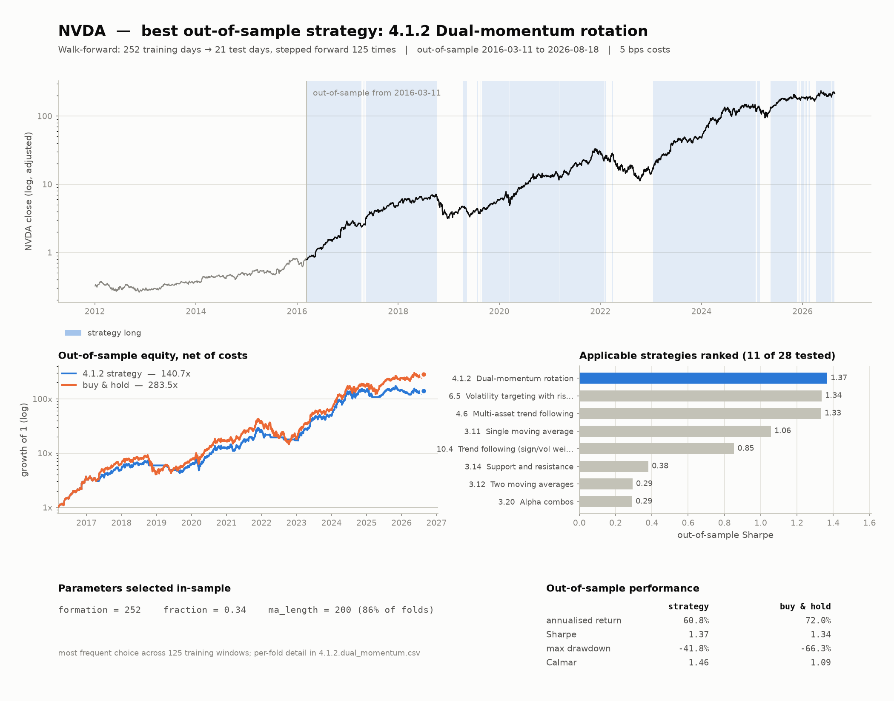
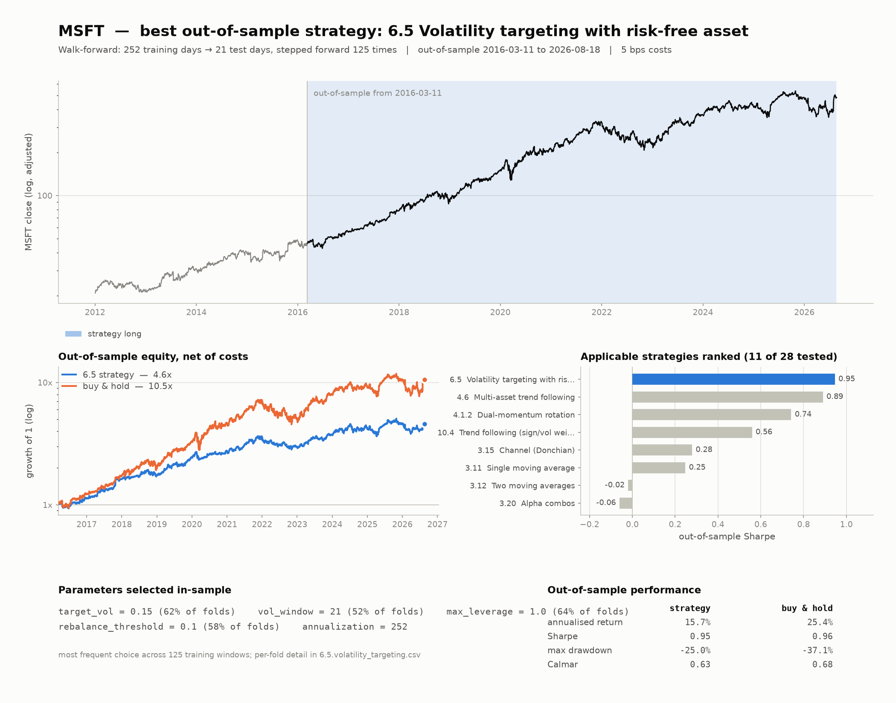
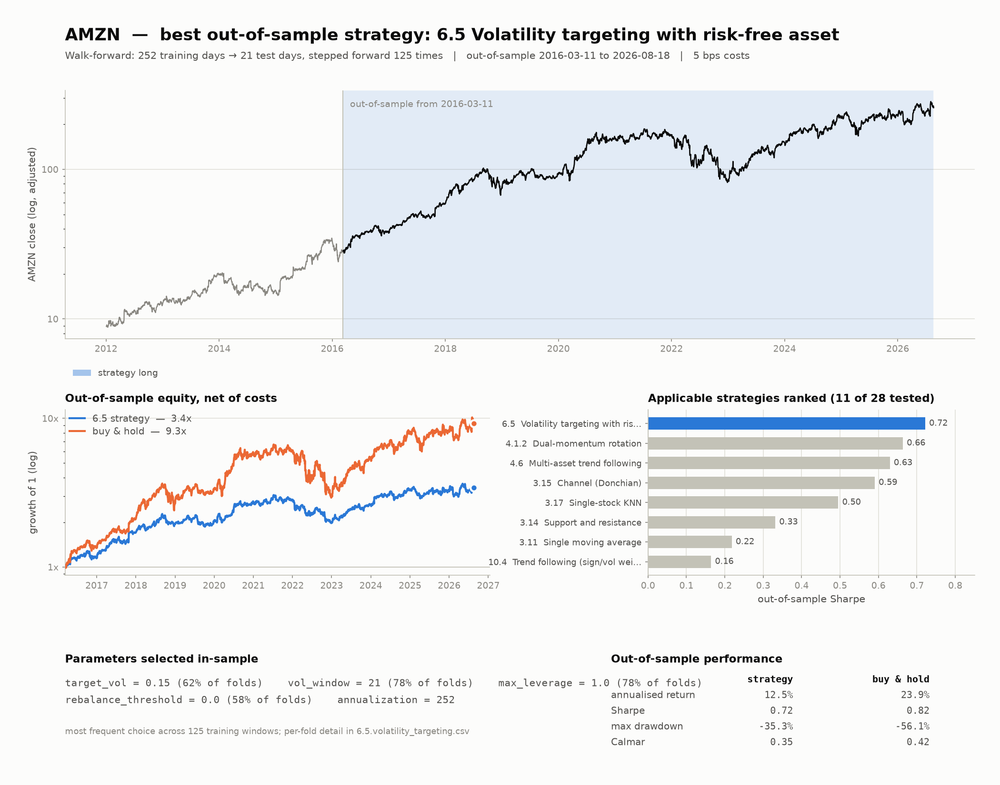
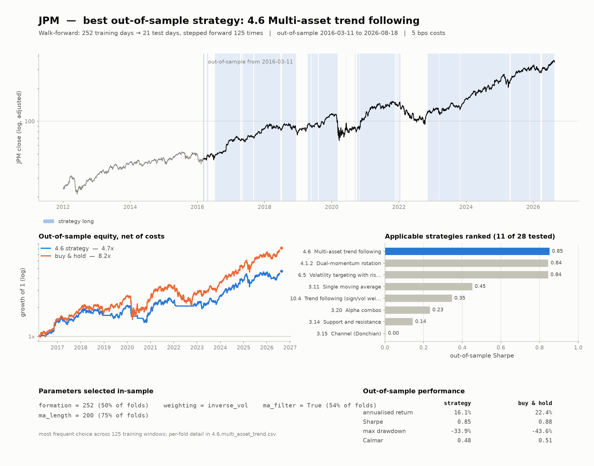

# Best strategy per ticker

* Universe tested one name at a time: `NVDA, TSLA, MSFT, AMZN, WMT, JPM`
* Bars: `stooq.daily`, 3680 rows, 2012-01-03 to 2026-08-21
* Windows: 252 training days -> 21 test days, walked forward
* Transaction cost: 5.0 bps, delay 1

Roughly half the library is cross-sectional and cannot express a view on a single name: demeaning one stock's return against itself gives zero, and a top third that is also the bottom third nets out. Those are detected and excluded from the ranking with the reason recorded in `<TICKER>_strategies.csv`.

| ticker   | section   | best_strategy                             |   ann_return_% |   sharpe |   max_drawdown_% |   calmar |   buy_hold_sharpe |   sharpe_vs_buy_hold |   applicable_strategies |
|:---------|:----------|:------------------------------------------|---------------:|---------:|-----------------:|---------:|------------------:|---------------------:|------------------------:|
| NVDA     | 4.1.2     | Dual-momentum rotation                    |          60.82 |     1.37 |           -41.77 |     1.46 |              1.34 |                 0.02 |                      11 |
| TSLA     | 6.5       | Volatility targeting with risk-free asset |          11.49 |     0.75 |           -25.88 |     0.44 |              0.82 |                -0.07 |                      11 |
| MSFT     | 6.5       | Volatility targeting with risk-free asset |          15.74 |     0.95 |           -24.98 |     0.63 |              0.96 |                -0.01 |                      11 |
| AMZN     | 6.5       | Volatility targeting with risk-free asset |          12.51 |     0.72 |           -35.32 |     0.35 |              0.82 |                -0.1  |                      11 |
| WMT      | 6.5       | Volatility targeting with risk-free asset |          17.14 |     0.95 |           -23.31 |     0.74 |              0.91 |                 0.04 |                      11 |
| JPM      | 4.6       | Multi-asset trend following               |          16.08 |     0.85 |           -33.85 |     0.48 |              0.88 |                -0.03 |                      11 |

## NVDA

**4.1.2 Dual-momentum rotation** — 11 of 28 strategies applicable.

Parameters selected in-sample:

```
formation = 252
fraction = 0.34
ma_length = 200 (86% of folds)
```



## TSLA

**6.5 Volatility targeting with risk-free asset** — 11 of 28 strategies applicable.

Parameters selected in-sample:

```
target_vol = 0.15
vol_window = 63 (61% of folds)
max_leverage = 1.0
rebalance_threshold = 0.1 (78% of folds)
annualization = 252
```


## MSFT

**6.5 Volatility targeting with risk-free asset** — 11 of 28 strategies applicable.

Parameters selected in-sample:

```
target_vol = 0.15 (62% of folds)
vol_window = 21 (52% of folds)
max_leverage = 1.0 (64% of folds)
rebalance_threshold = 0.1 (58% of folds)
annualization = 252
```



## AMZN

**6.5 Volatility targeting with risk-free asset** — 11 of 28 strategies applicable.

Parameters selected in-sample:

```
target_vol = 0.15 (62% of folds)
vol_window = 21 (78% of folds)
max_leverage = 1.0 (78% of folds)
rebalance_threshold = 0.0 (58% of folds)
annualization = 252
```



## WMT

**6.5 Volatility targeting with risk-free asset** — 11 of 28 strategies applicable.

Parameters selected in-sample:

```
target_vol = 0.15 (46% of folds)
vol_window = 21 (67% of folds)
max_leverage = 1.0 (54% of folds)
rebalance_threshold = 0.1 (74% of folds)
annualization = 252
```


## JPM

**4.6 Multi-asset trend following** — 11 of 28 strategies applicable.

Parameters selected in-sample:

```
formation = 252 (50% of folds)
weighting = inverse_vol
ma_filter = True (54% of folds)
ma_length = 200 (75% of folds)
```


