# Best strategy per ticker

* Universe tested one name at a time: `GOOGL, MO, APA, AFL, ABT, MMM, ACN, APD, ARE, AES, GOOG`
* Bars: `stooq.daily`, 3680 rows, 2012-01-03 to 2026-08-21
* Windows: 252 training days -> 21 test days, walked forward
* Transaction cost: 5.0 bps, delay 1

Roughly half the library is cross-sectional and cannot express a view on a single name: demeaning one stock's return against itself gives zero, and a top third that is also the bottom third nets out. Those are detected and excluded from the ranking with the reason recorded in `<TICKER>_strategies.csv`.

| ticker   |   section | best_strategy                             |   ann_return_% |   sharpe |   max_drawdown_% |   calmar |   buy_hold_sharpe |   sharpe_vs_buy_hold |   applicable_strategies |
|:---------|----------:|:------------------------------------------|---------------:|---------:|-----------------:|---------:|------------------:|---------------------:|------------------------:|
| GOOGL    |      6.5  | Volatility targeting with risk-free asset |          14.55 |     0.84 |           -26.48 |     0.55 |              0.89 |                -0.04 |                      11 |
| MO       |      6.5  | Volatility targeting with risk-free asset |           6.5  |     0.45 |           -39.34 |     0.17 |              0.42 |                 0.03 |                      11 |
| APA      |      3.11 | Single moving average                     |           6.9  |     0.39 |           -65.85 |     0.1  |              0.33 |                 0.06 |                      11 |
| AFL      |      6.5  | Volatility targeting with risk-free asset |          12.59 |     0.75 |           -38.43 |     0.33 |              0.74 |                 0.01 |                      11 |
| ABT      |      6.5  | Volatility targeting with risk-free asset |           8.51 |     0.55 |           -38.03 |     0.22 |              0.63 |                -0.08 |                      11 |
| MMM      |      3.15 | Channel (Donchian)                        |          13.78 |     0.66 |           -45.15 |     0.31 |              0.36 |                 0.3  |                      11 |
| ACN      |      6.5  | Volatility targeting with risk-free asset |           6.48 |     0.45 |           -44.98 |     0.14 |              0.38 |                 0.08 |                      11 |
| APD      |      6.5  | Volatility targeting with risk-free asset |           8.41 |     0.55 |           -28.45 |     0.3  |              0.56 |                -0.01 |                      11 |
| ARE      |      3.15 | Channel (Donchian)                        |          -0.54 |     0.12 |           -59.85 |    -0.01 |              0.07 |                 0.04 |                      11 |
| AES      |      6.5  | Volatility targeting with risk-free asset |           5.47 |     0.4  |           -44.16 |     0.12 |              0.37 |                 0.03 |                      11 |
| GOOG     |      6.5  | Volatility targeting with risk-free asset |          16.03 |     0.91 |           -25.03 |     0.64 |              0.9  |                 0.02 |                      11 |

## Is it statistically relevant, or luck?

Three different questions, in increasing order of how much they ask:

* `p_vs_buy_hold` - a one-sided Newey-West t-test that the strategy's daily return exceeds that ticker's own buy & hold. Autocorrelation-robust, but it takes the winner as given. A value near 1 does not mean "no difference" - it means the difference runs the other way.
* `reality_check_p` / `spa_p` - White's Reality Check and Hansen's SPA, which bootstrap all applicable candidates jointly (stationary bootstrap, so serial dependence survives resampling) and ask how often chance alone produces a maximum this large. **This is the test that accounts for the winner having been selected as the best of many.**
* `deflated_sharpe_prob` - the probability the winner's Sharpe survives deflation for the number of trials, their dispersion, and the return distribution's skew and kurtosis.

| ticker   | best_strategy              |   excess_ann_return_% |   t_stat_vs_buy_hold |   p_vs_buy_hold |   reality_check_p |   spa_p |   deflated_sharpe_prob | verdict                                    |
|:---------|:---------------------------|----------------------:|---------------------:|----------------:|------------------:|--------:|-----------------------:|:-------------------------------------------|
| ABT      | 6.5.volatility_targeting   |                 -5.18 |                -2.07 |           0.981 |             0.997 |   1     |                  0.569 | lower return than buy & hold (significant) |
| ACN      | 6.5.volatility_targeting   |                 -2.76 |                -0.67 |           0.75  |             0.889 |   1     |                  0.433 | not distinguishable from luck              |
| AES      | 6.5.volatility_targeting   |                 -6.29 |                -1.02 |           0.847 |             0.854 |   0.856 |                  0.536 | not distinguishable from luck              |
| AFL      | 6.5.volatility_targeting   |                 -5.42 |                -1.63 |           0.948 |             0.986 |   1     |                  0.557 | profitable, but no better than buy & hold  |
| APA      | 3.11.single_moving_average |                  2.29 |                 0.08 |           0.469 |             0.811 |   0.819 |                  0.619 | not distinguishable from luck              |
| APD      | 6.5.volatility_targeting   |                 -4.71 |                -1.62 |           0.947 |             0.993 |   1     |                  0.479 | profitable, but no better than buy & hold  |
| ARE      | 3.15.channel               |                  1.09 |                 0.09 |           0.465 |             0.829 |   0.813 |                  0.133 | not distinguishable from luck              |
| GOOGL    | 6.5.volatility_targeting   |                -10.65 |                -2.86 |           0.998 |             1     |   1     |                  0.858 | lower return than buy & hold (significant) |
| GOOG     | 6.5.volatility_targeting   |                 -9.5  |                -2.59 |           0.995 |             1     |   1     |                  0.919 | lower return than buy & hold (significant) |
| MMM      | 3.15.channel               |                  6.17 |                 0.65 |           0.258 |             0.64  |   0.648 |                  0.633 | profitable, but no better than buy & hold  |
| MO       | 6.5.volatility_targeting   |                 -1.89 |                -0.75 |           0.774 |             0.95  |   1     |                  0.668 | not distinguishable from luck              |

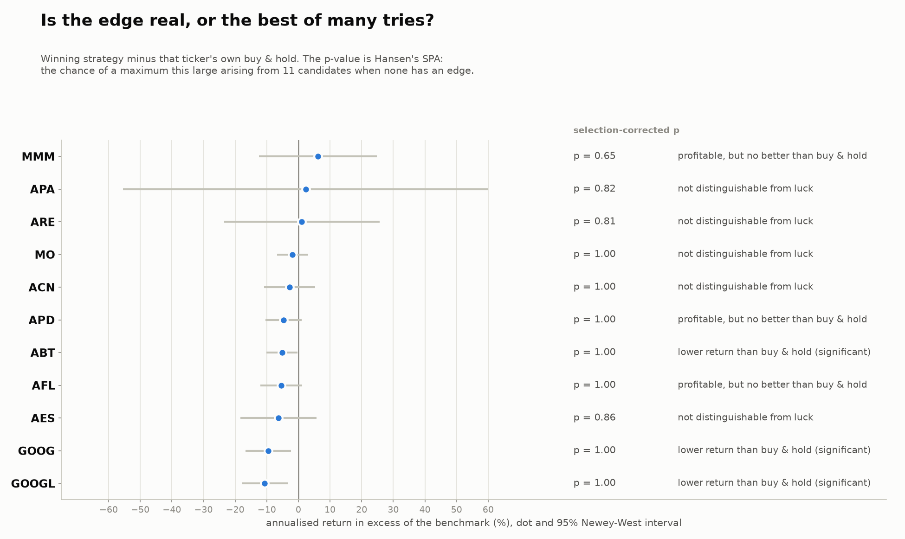

## GOOGL

**6.5 Volatility targeting with risk-free asset** — 11 of 28 strategies applicable.

Parameters selected in-sample:

```
target_vol = 0.15 (63% of folds)
vol_window = 21 (65% of folds)
max_leverage = 1.0 (74% of folds)
rebalance_threshold = 0.1 (64% of folds)
annualization = 252
```

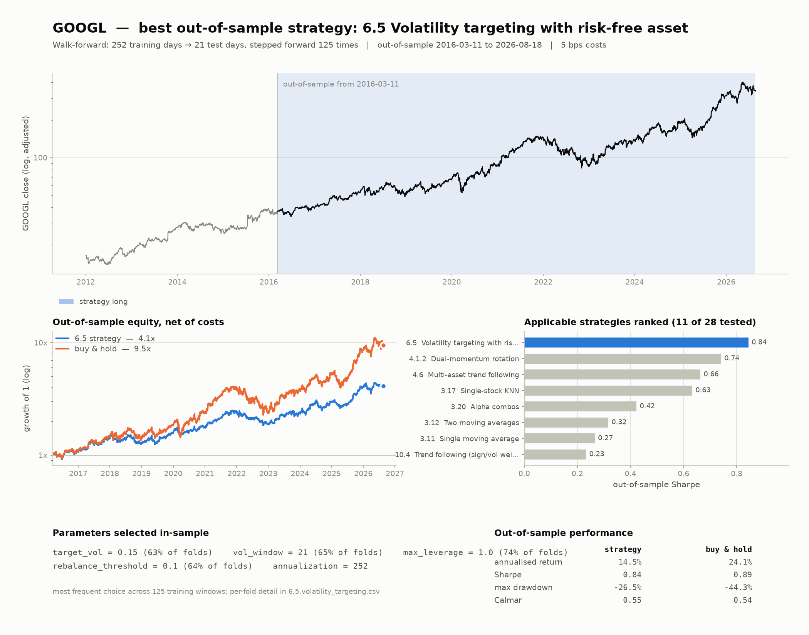

## MO

**6.5 Volatility targeting with risk-free asset** — 11 of 28 strategies applicable.

Parameters selected in-sample:

```
target_vol = 0.2 (49% of folds)
vol_window = 21 (50% of folds)
max_leverage = 1.0 (73% of folds)
rebalance_threshold = 0.1 (70% of folds)
annualization = 252
```

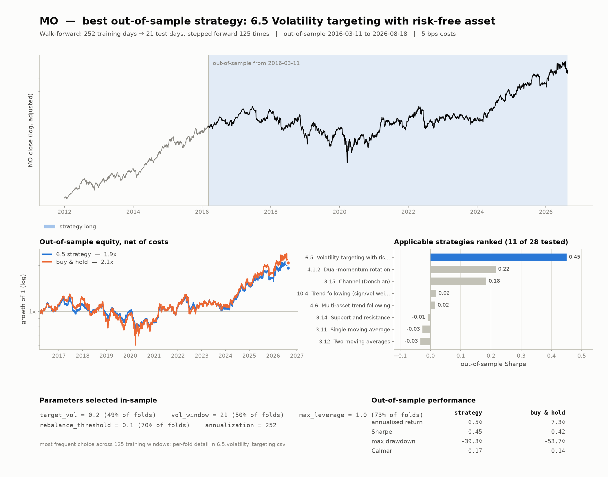

## APA

**3.11 Single moving average** — 11 of 28 strategies applicable.

Parameters selected in-sample:

```
length = 200 (48% of folds)
kind = sma (84% of folds)
lam = 0.9
long_only = False (54% of folds)
```

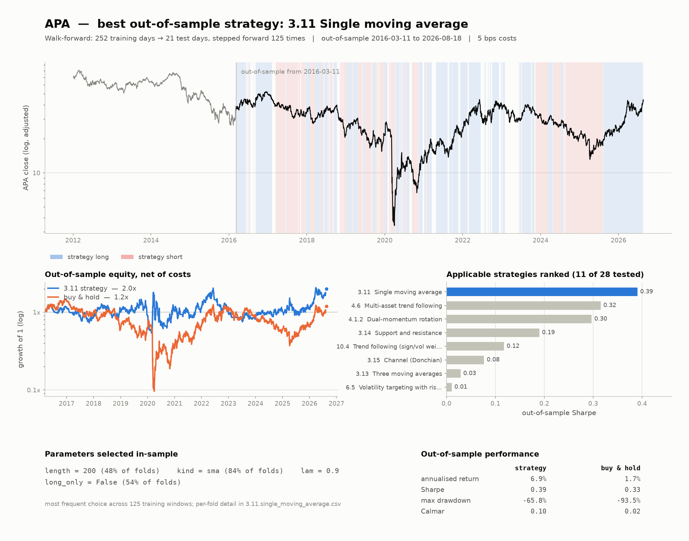

## AFL

**6.5 Volatility targeting with risk-free asset** — 11 of 28 strategies applicable.

Parameters selected in-sample:

```
target_vol = 0.15 (54% of folds)
vol_window = 63 (68% of folds)
max_leverage = 1.0 (73% of folds)
rebalance_threshold = 0.1 (76% of folds)
annualization = 252
```

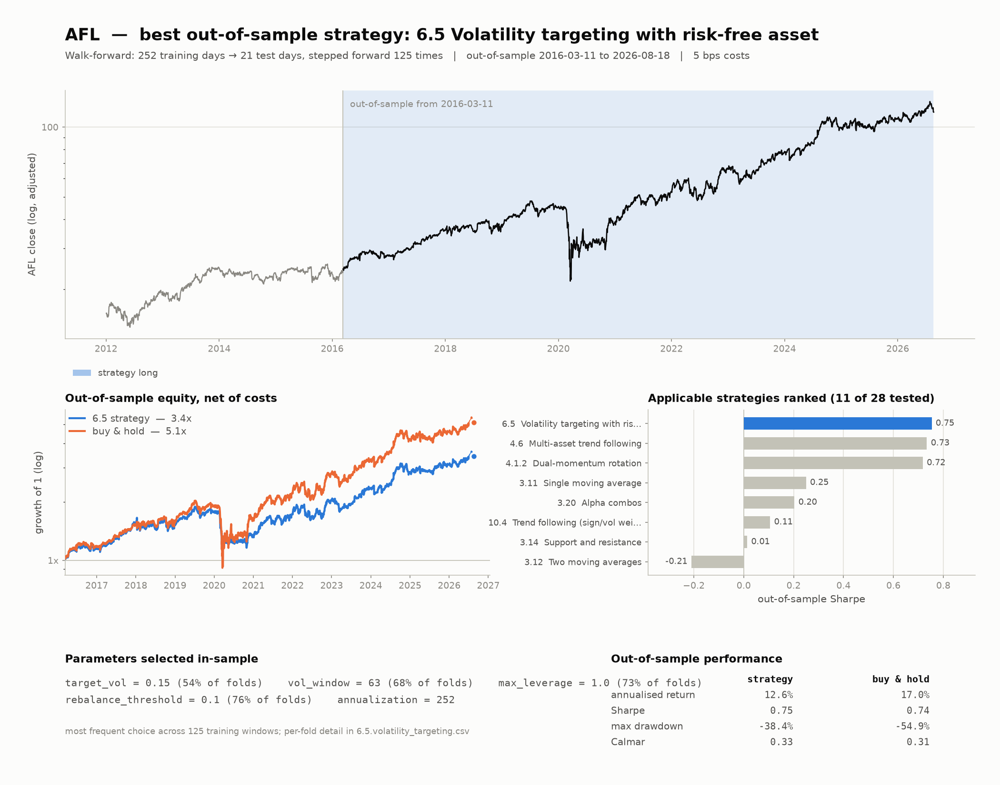

## ABT

**6.5 Volatility targeting with risk-free asset** — 11 of 28 strategies applicable.

Parameters selected in-sample:

```
target_vol = 0.15 (52% of folds)
vol_window = 21 (63% of folds)
max_leverage = 1.0 (62% of folds)
rebalance_threshold = 0.1 (72% of folds)
annualization = 252
```

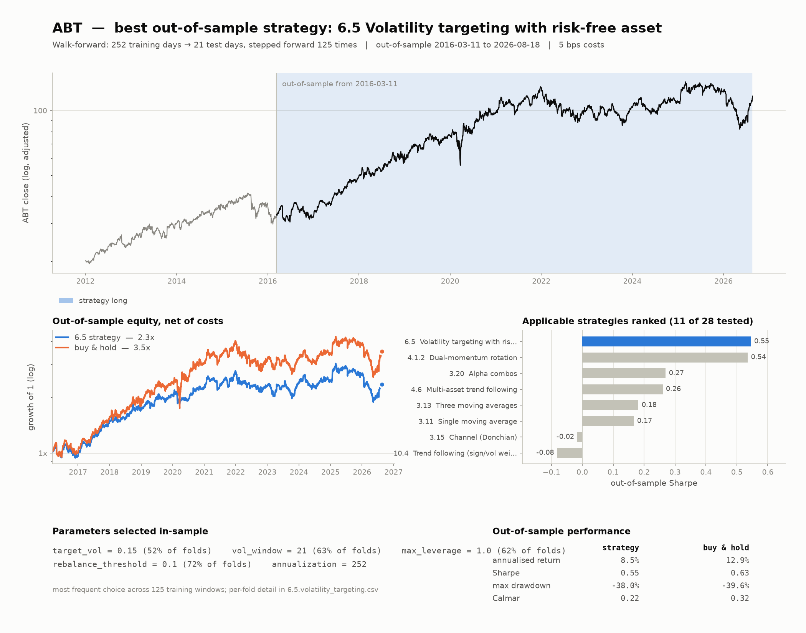

## MMM

**3.15 Channel (Donchian)** — 11 of 28 strategies applicable.

Parameters selected in-sample:

```
length = 20 (48% of folds)
mode = reversion (54% of folds)
long_only = False (58% of folds)
```

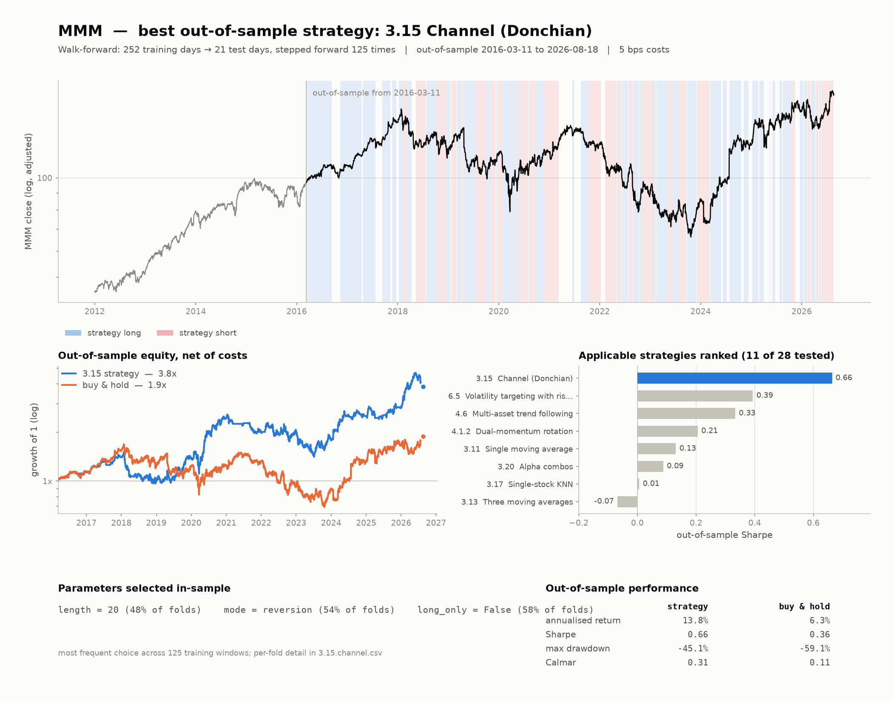

## ACN

**6.5 Volatility targeting with risk-free asset** — 11 of 28 strategies applicable.

Parameters selected in-sample:

```
target_vol = 0.15 (66% of folds)
vol_window = 21 (58% of folds)
max_leverage = 1.0 (73% of folds)
rebalance_threshold = 0.1 (72% of folds)
annualization = 252
```

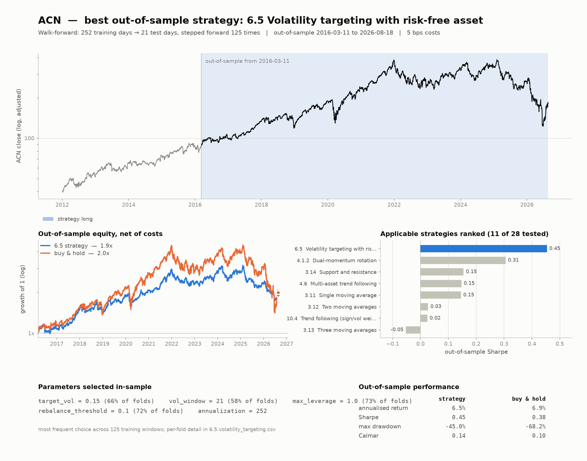

## APD

**6.5 Volatility targeting with risk-free asset** — 11 of 28 strategies applicable.

Parameters selected in-sample:

```
target_vol = 0.2 (45% of folds)
vol_window = 21 (69% of folds)
max_leverage = 1.0 (70% of folds)
rebalance_threshold = 0.1 (64% of folds)
annualization = 252
```

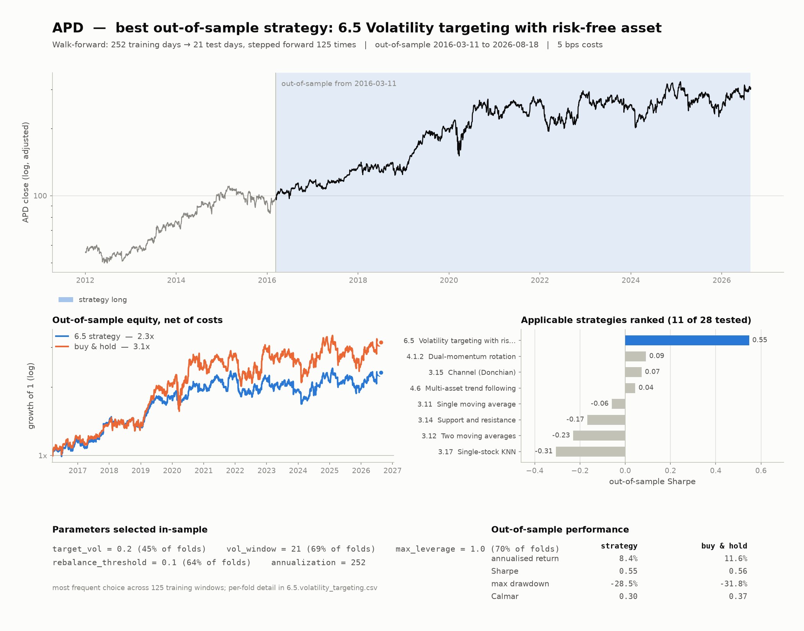

## ARE

**3.15 Channel (Donchian)** — 11 of 28 strategies applicable.

Parameters selected in-sample:

```
length = 50 (42% of folds)
mode = reversion (72% of folds)
long_only = False (60% of folds)
```

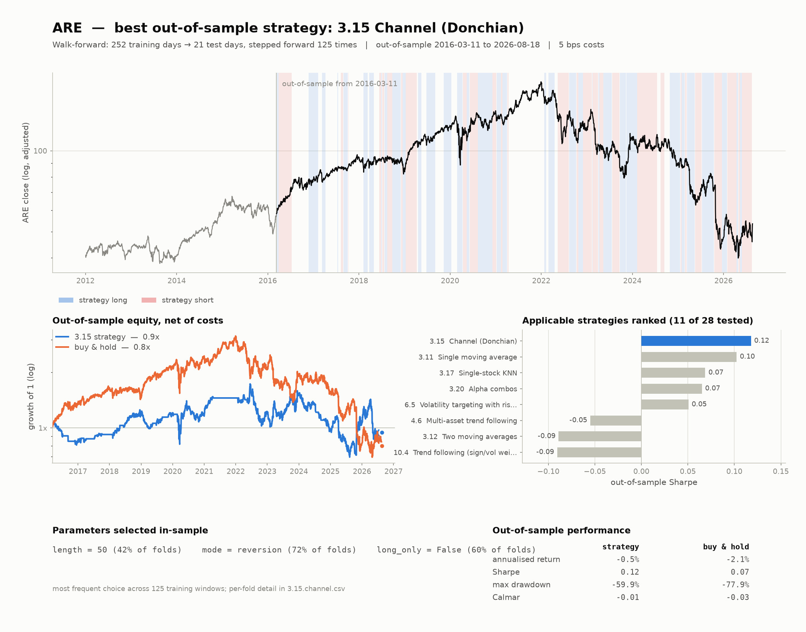

## AES

**6.5 Volatility targeting with risk-free asset** — 11 of 28 strategies applicable.

Parameters selected in-sample:

```
target_vol = 0.15 (67% of folds)
vol_window = 21 (55% of folds)
max_leverage = 1.0 (87% of folds)
rebalance_threshold = 0.1 (59% of folds)
annualization = 252
```

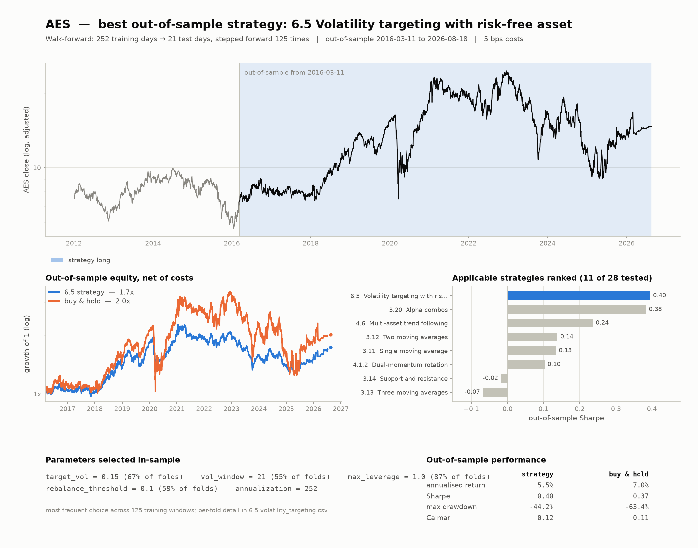

## GOOG

**6.5 Volatility targeting with risk-free asset** — 11 of 28 strategies applicable.

Parameters selected in-sample:

```
target_vol = 0.15 (62% of folds)
vol_window = 21 (70% of folds)
max_leverage = 1.0 (78% of folds)
rebalance_threshold = 0.1 (69% of folds)
annualization = 252
```

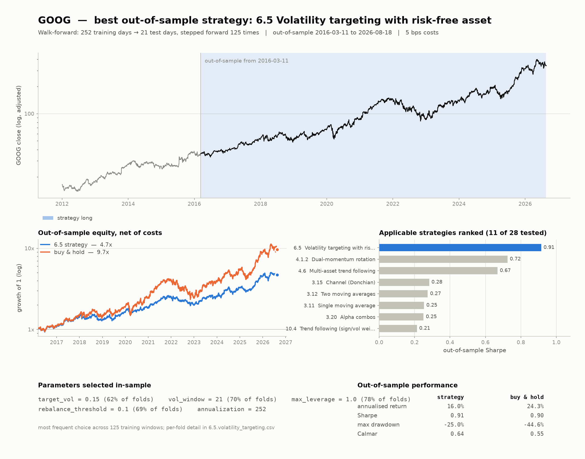
